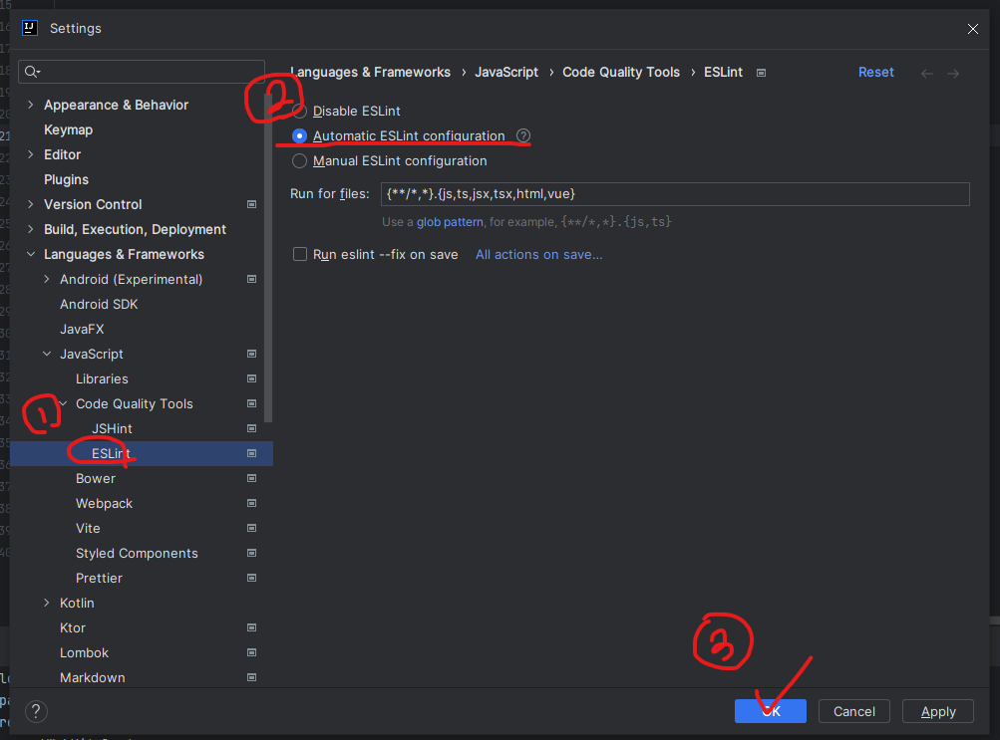

# Installation step by step guide

## 1. NVM 설치 (Recommend)

- nvm은 node의 여러버전을 동시에 사용할 수 있게 하는 node 버전관리 툴

### nvm (For linux os)

다음 링크에서 설치가능:
https://github.com/nvm-sh/nvm

### nvm-windows (For window os)

다음 링크에서 설치가능:
https://github.com/coreybutler/nvm-windows

## 2. NVM Post-installation

- 실행중인 IDE 및 터미널 종류 후 재실행

## 3. Node 설치

### With the NVM

**Install current lts version of the node**

```shell
$ nvm install node
$ nvm use node # node라고 이름 붙혀진 node 버전을 사용하겠다는 명령어
```

- 위 명령어로 node version `v20.8.0` 설치됨(2023-10-03 Windows 11 OS 기준)

**Install specific(v20.8.0) version of the node**

- 혹시 `v20.8.0`이 아닌 버전이 설치된다면, 아래 명령어로 설치후 사용 설정

```shell
$ nvm install 20.8.0
$ nvm use 20.8.0
```

### NVM에서 설치된 node 버전 확인

```shell
$ nvm list
```

- 결과에서 버전이름 앞에 `*`가 붙은 것이 현재 지정된 버전
- node는 프로젝트 별로 `node_modules`라는 폴더에서 패키지 관리가 되므로 별도의 가상환경 설정 불필요
- 패키지 정보 및 프로젝트 관련 설정은 `package.json`에서 설정됨

### Without the NVM (비추비추 안쓰는 게 정신건강에 좋음)

- 따라서 이하생략

# 4. Pull this repository

- 하세요

# 5. yarn 설치 (준비 끝)

- 본 프로젝트는 `npm` 대신 `yarn`을 패키지 관리자로 사용하므로 yarn을 글로벌로 설치 필요

```shell
$ cd ~/[your_project_root]
$ npm install -g yarn # 설치후 대부분의 커맨드는 yarn이 대체하므로 의존성이 꼬이지 않도록 yarn만 사용
$ yarn # 패키지 설치
```

# Getting Started with Create React App

This project was bootstrapped with [Create React App](https://github.com/facebook/create-react-app).

## Available Scripts

In the project directory, you can run:

### `yarn start`

Runs the app in the development mode.\
Open [http://localhost:3000](http://localhost:3000) to view it in the browser.

The page will reload if you make edits.\
You will also see any lint errors in the console.

### `yarn test`

Launches the test runner in the interactive watch mode.\
See the section about [running tests](https://facebook.github.io/create-react-app/docs/running-tests) for more information.

### `yarn build`

Builds the app for production to the `build` folder.\
It correctly bundles React in production mode and optimizes the build for the best performance.

The build is minified and the filenames include the hashes.\
Your app is ready to be deployed!

See the section about [deployment](https://facebook.github.io/create-react-app/docs/deployment) for more information.

### `yarn eject`

**Note: this is a one-way operation. Once you `eject`, you can’t go back!**

If you aren’t satisfied with the build tool and configuration choices, you can `eject` at any time. This command will remove the single build dependency from your project.

Instead, it will copy all the configuration files and the transitive dependencies (webpack, Babel, ESLint, etc) right into your project so you have full control over them. All of the commands except `eject` will still work, but they will point to the copied scripts so you can tweak them. At this point you’re on your own.

You don’t have to ever use `eject`. The curated feature set is suitable for small and middle deployments, and you shouldn’t feel obligated to use this feature. However we understand that this tool wouldn’t be useful if you couldn’t customize it when you are ready for it.

## Learn More

You can learn more in the [Create React App documentation](https://facebook.github.io/create-react-app/docs/getting-started).

To learn React, check out the [React documentation](https://reactjs.org/).

# 개발 중 필요한 것들

## 컨벤션 및 Linter

### IDE 에서 eslint 설정 허용



- [typescript-eslint](https://typescript-eslint.io/getting-started)
- prettier
- git-hooks(husky and lint-staged)

## Folder Structure

https://create-react-app.dev/docs/folder-structure/

## Router :: React Router

- router는 페이지 경로를 관리하는 주체
- 이 프로젝트에서 사용하는 것은 `react-router`

## UI :: Material UI(MUI)

https://mui.com/material-ui/getting-started/
